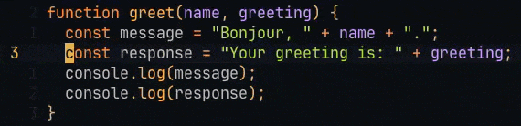

# change-in-line.nvim

Neovim plugin that makes `ci`/`ca` work on the current line — even when your cursor is not inside a pair.



## Features

- Works with `"`, `'`, `` ` ``, `(`, `{`, `[`, `<`
- Already inside a pair → acts directly, no labels
- Only 1 pair on the line → acts directly, no labels
- Multiple pairs on the line → displays numbered labels over each pair, press the number to act on it, `Esc` to cancel
- Ignores escaped characters (`\"`, `\'`...)

## Installation

With lazy.nvim:

```lua
{
  "marc-alexis-com/change-in-line.nvim",
  config = function()
    require("change-in-line").setup()
  end,
}
```

## Usage

| Keymap | Action |
|--------|--------|
| `ci"` | Change inside `"..."` on current line |
| `ca"` | Change around `"..."` on current line |
| `ci(` | Change inside `(...)` on current line |
| `ca(` | Change around `(...)` on current line |
| `ci{` | Change inside `{...}` on current line |
| `ci[` | Change inside `[...]` on current line |
| `ci<` | Change inside `<...>` on current line |
| `ci'` | Change inside `'...'` on current line |
| `` ci` `` | Change inside `` `...` `` on current line |

## Known Limitations

- Lines mixing escaped `\"` and regular `"` may produce unexpected results (Neovim's native `ci"` does not handle escaped quotes)
- Nested pairs like `(foo(bar))` always targets the innermost pair
- `ci<` handles literal `<>` pairs, not HTML/XML tags (use `cit` for tags)
- `'` support may conflict with apostrophes in natural language text

## Roadmap

- [x] Label mode to choose between multiple pairs
- [x] No labels when already inside a pair
- [x] Support `"`, `'`, `` ` ``, `(`, `{`, `[`, `<`
- [ ] Stack-based detection for nested pairs like `(foo(bar))`
- [ ] Treesitter integration for context-aware parsing
